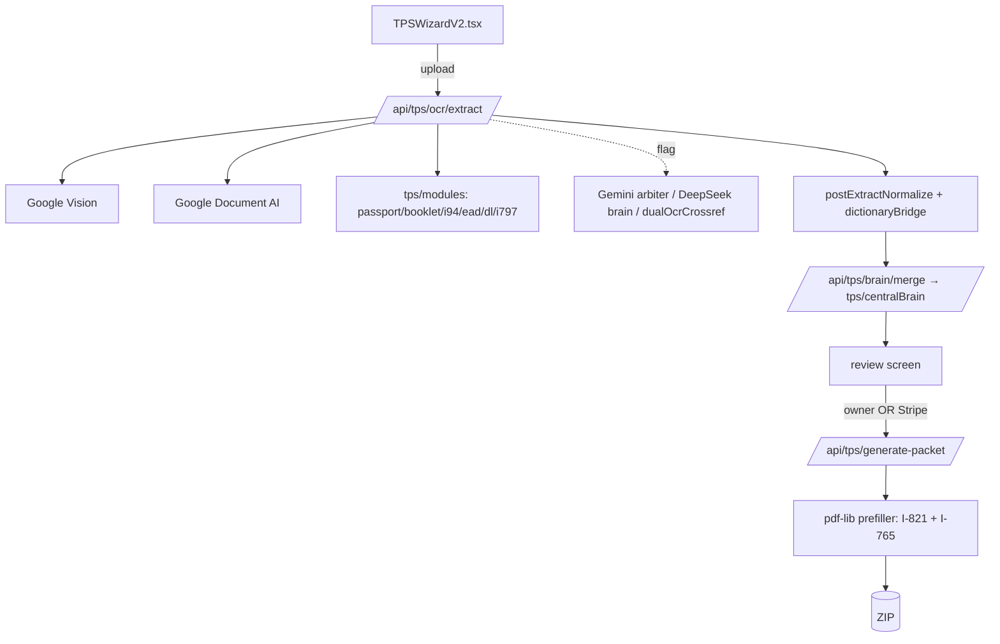
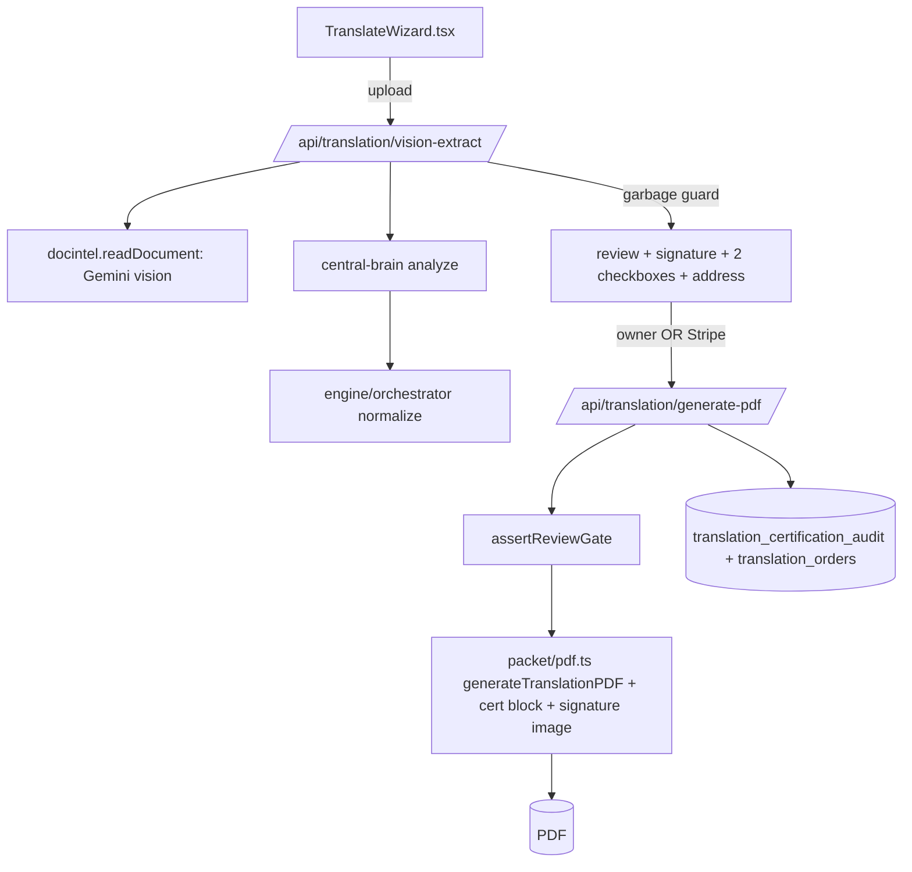
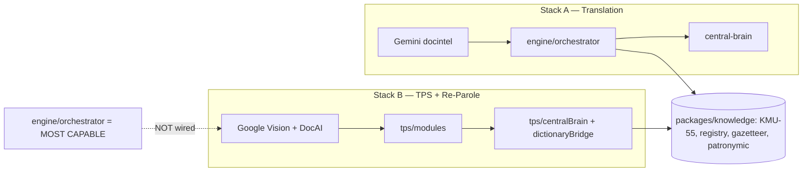
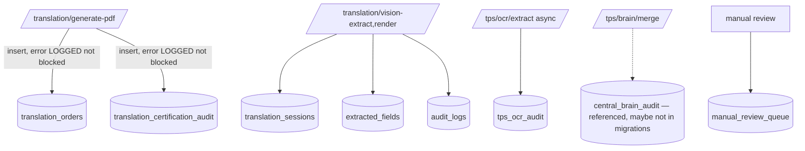

# Architecture Dependency Map
**Date:** 2026-05-30 · READ-ONLY.

## TPS flow


## Translation flow


## OCR / brain flow (the two-brain divergence)


## PDF flow
```mermaid
flowchart TD
  LIVE[packet/pdf.ts — LIVE: translation flat PDF + cert + signature] --> OUTL[(PDF)]
  BUREAU[renderOfficialTranslation — FLAGGED BUREAU_PDF off] --> OUTB[(PDF, civil schemas)]
  MAR[renderMarriageCertificateTranslation — DEAD 0 importers] -.x.-> BUREAU
  TPSF[tps prefiller — LIVE: I-821/I-765/I-131] --> OUTZ[(ZIP)]
  EADF[ead/i765FieldMap — LIVE: I-765] --> OUTE[(HTML/PDF)]
  BSR[bureauStyleRenderer — text/audit only]
```

## DB / audit flow


## Notes
- `engine/orchestrator` (most capable) is wired only via central-brain/docintel → Translation; TPS does NOT use it (the divergence).
- Dead nodes: `engine/assembler`, `knowledge/normalize.ts`, `renderMarriageCertificateTranslation`, `engine/htr` (broken).
- 20 distinct DB tables touched across 47 routes; 26 migrations.
